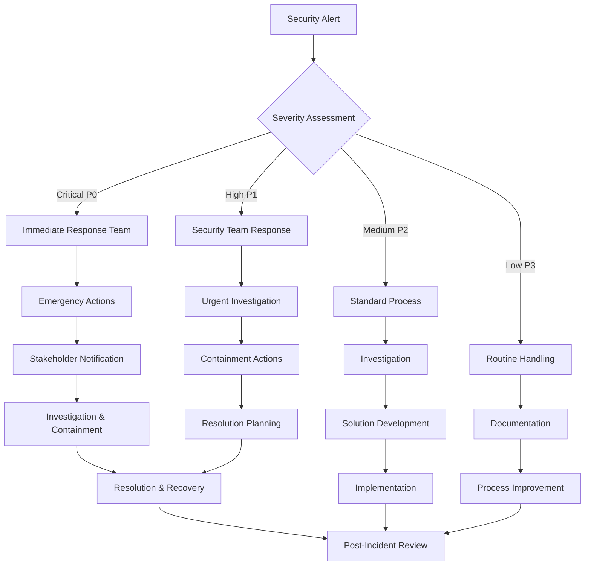

# GitHub Security Policies & Configuration

## 🔒 Repository Security Configuration

### Required GitHub Settings

#### Repository Settings → Security
```yaml
Security Features:
  ✅ Private vulnerability reporting
  ✅ Token scanning alerts  
  ✅ Push protection for detected secrets
  ✅ Dependency graph
  ✅ Dependabot alerts
  ✅ Dependabot security updates
  ✅ Dependabot version updates
  ✅ Code scanning alerts
```

#### Advanced Security (GitHub Enterprise)
```yaml
Advanced Features:
  ✅ Secret scanning for private repositories
  ✅ Code scanning with CodeQL
  ✅ Dependency review
  ✅ Security overview dashboard
```

### Branch Protection Configuration

#### Main Branch Protection
```bash
# GitHub CLI commands to configure protection
gh api repos/:owner/:repo/branches/main/protection \
  --method PUT \
  --field required_status_checks='{"strict":true,"contexts":["ci/tests","security/scan","coverage/check"]}' \
  --field enforce_admins=true \
  --field required_pull_request_reviews='{"required_approving_reviews":2,"dismiss_stale_reviews":true,"require_code_owner_reviews":true}' \
  --field restrictions='{"users":[],"teams":["core-team"],"apps":[]}' \
  --field required_linear_history=true \
  --field allow_force_pushes=false \
  --field allow_deletions=false \
  --field block_creations=false
```

#### Rulesets (New GitHub Feature)
```yaml
Repository Rulesets:
  - Name: "Main Branch Protection"
    Target: "main"
    Rules:
      - Require pull request before merging
      - Require status checks to pass
      - Require branches to be up to date
      - Require conversation resolution
      - Require signed commits
      - Block force pushes
      - Restrict pushes that create files over 100MB
      
  - Name: "License Protection"
    Target: "~ALL"
    Rules:
      - Restrict files matching pattern: "**/license.rs"
      - Restrict files matching pattern: "**/features.rs"
      - Require admin approval for license-related changes
```

## 🛡️ Access Control Policies

### Team Structure
```yaml
GitHub Teams:

@chessvector/core-team:
  Members: [maintainer-usernames]
  Permissions: Admin
  Repositories: 
    - chess-vector-engine: Admin
    - chess-vector-premium: Admin (private)
    - chess-vector-enterprise: Admin (private)

@chessvector/security-team:
  Members: [security-focused-team-members]
  Permissions: Maintain
  Responsibilities:
    - License violation investigations
    - Security issue triage
    - DMCA response coordination

@chessvector/contributors:
  Members: [regular-contributors]
  Permissions: Write
  Repositories:
    - chess-vector-engine: Write (open source only)

@chessvector/community:
  Members: [community-moderators]
  Permissions: Triage
  Responsibilities:
    - Issue triage
    - Community guidelines enforcement
    - First-level support
```

### Repository Permissions
```yaml
Base Permissions: Read

Custom Roles:
  License Auditor:
    - Read repository contents
    - Read issues and pull requests
    - Create and comment on issues
    - Cannot modify license-related files
    
  Community Contributor:
    - All Triage permissions
    - Push to topic branches
    - Cannot push to protected branches
    - Cannot modify security files
    
  Security Analyst:
    - All Write permissions
    - Access to security alerts
    - Can trigger security scans
    - Cannot modify core license logic
```

## 🔍 Monitoring and Alerting

### Automated Security Scans

#### CodeQL Configuration
```yaml
# .github/workflows/codeql.yml
name: "CodeQL Security Analysis"

on:
  push:
    branches: [ main, develop ]
  pull_request:
    branches: [ main ]
  schedule:
    - cron: '0 2 * * 1'  # Weekly Monday 2 AM

jobs:
  analyze:
    runs-on: ubuntu-latest
    permissions:
      security-events: write
      
    strategy:
      fail-fast: false
      matrix:
        language: [ 'rust' ]
        
    steps:
    - name: Checkout repository
      uses: actions/checkout@v4
      
    - name: Initialize CodeQL
      uses: github/codeql-action/init@v3
      with:
        languages: ${{ matrix.language }}
        queries: security-and-quality
        
    - name: Build
      run: cargo build --release
      
    - name: Perform CodeQL Analysis
      uses: github/codeql-action/analyze@v3
      with:
        category: "/language:${{matrix.language}}"
```

#### Custom Security Checks
```yaml
# .github/workflows/security-audit.yml
name: "🔒 Security Audit"

on:
  push:
  pull_request:
  schedule:
    - cron: '0 3 * * *'  # Daily at 3 AM

jobs:
  license-integrity:
    name: "License System Integrity"
    runs-on: ubuntu-latest
    steps:
    - uses: actions/checkout@v4
    
    - name: Check license verification code
      run: |
        # Verify license.rs hasn't been tampered with
        EXPECTED_HASH="sha256sum_of_license_rs"
        ACTUAL_HASH=$(sha256sum src/license.rs | cut -d' ' -f1)
        
        if [ "$EXPECTED_HASH" != "$ACTUAL_HASH" ]; then
          echo "🚨 License verification code has been modified!"
          exit 1
        fi
        
    - name: Verify feature gating integrity  
      run: |
        # Check that premium features still have protection
        MISSING_CHECKS=$(grep -r "ultra_fast_load\|gpu_acceleration\|nnue" src/ | grep -v "require_feature" | wc -l)
        
        if [ $MISSING_CHECKS -gt 0 ]; then
          echo "🚨 Found premium features without license checks!"
          grep -r "ultra_fast_load\|gpu_acceleration\|nnue" src/ | grep -v "require_feature"
          exit 1
        fi

  dependency-audit:
    name: "Dependency Security Audit"
    runs-on: ubuntu-latest
    steps:
    - uses: actions/checkout@v4
    
    - name: Install cargo-audit
      run: cargo install cargo-audit
      
    - name: Run security audit
      run: cargo audit
      
    - name: Check for known vulnerabilities
      run: |
        # Additional security checks
        cargo audit --json | jq '.vulnerabilities | length' > vuln_count.txt
        VULN_COUNT=$(cat vuln_count.txt)
        
        if [ $VULN_COUNT -gt 0 ]; then
          echo "🚨 Found $VULN_COUNT security vulnerabilities!"
          cargo audit
          exit 1
        fi

  secrets-scan:
    name: "Secrets Detection"
    runs-on: ubuntu-latest
    steps:
    - uses: actions/checkout@v4
      with:
        fetch-depth: 0
        
    - name: Run TruffleHog
      uses: trufflesecurity/trufflehog@main
      with:
        path: ./
        base: main
        head: HEAD
        extra_args: --debug --only-verified
```

### Alert Configuration

#### Dependabot Configuration
```yaml
# .github/dependabot.yml
version: 2
updates:
  - package-ecosystem: "cargo"
    directory: "/"
    schedule:
      interval: "weekly"
      day: "monday"
      time: "02:00"
    open-pull-requests-limit: 10
    reviewers:
      - "@chessvector/security-team"
    assignees:
      - "@chessvector/core-team"
    commit-message:
      prefix: "security"
      include: "scope"
    labels:
      - "dependencies"
      - "security"
    
  - package-ecosystem: "github-actions"
    directory: "/"
    schedule:
      interval: "weekly"
    reviewers:
      - "@chessvector/security-team"
```

#### Security Advisory Configuration
```yaml
Security Advisories:
  Auto-create: true
  Severity-threshold: "medium"
  Notify:
    - security@chessvector.ai
    - "@chessvector/security-team"
  
Response-times:
  Critical: 24 hours
  High: 72 hours  
  Medium: 1 week
  Low: 1 month
```

## 🚨 Incident Response Plan

### Security Incident Classification

#### Critical (P0) - Immediate Response
- Active license bypass exploitation
- Security vulnerability in license system
- Unauthorized access to private repositories
- Data breach or leak

**Response Time**: 1 hour
**Escalation**: CEO, CTO, Legal Team

#### High (P1) - Urgent Response  
- License violation detection
- Security vulnerability in core features
- Compromise of build infrastructure
- DMCA violation reports

**Response Time**: 4 hours
**Escalation**: Security Team, Engineering Lead

#### Medium (P2) - Standard Response
- Dependency vulnerabilities
- Community guidelines violations
- Suspicious fork activity
- Performance security issues

**Response Time**: 24 hours
**Escalation**: Security Team

#### Low (P3) - Routine Response
- Documentation security improvements
- Process enhancement suggestions
- Community education needs
- Monitoring system improvements

**Response Time**: 1 week
**Escalation**: Community Team

### Incident Response Workflow



### Contact Information

#### Primary Contacts
```yaml
Security Team Lead: security-lead@chessvector.ai
Legal Counsel: legal@chessvector.ai
Emergency Contact: emergency@chessvector.ai (+1-XXX-XXX-XXXX)

GitHub Teams:
  @chessvector/security-team
  @chessvector/core-team
  @chessvector/legal-team
```

#### Escalation Matrix
```yaml
Level 1: Security Team Member
Level 2: Security Team Lead
Level 3: Engineering Director
Level 4: CTO
Level 5: CEO + Legal Team
```

## 📋 Compliance and Auditing

### Regular Security Reviews

#### Weekly Reviews
- [ ] Dependabot alerts review
- [ ] Security scan results analysis
- [ ] Fork monitoring report
- [ ] Community violation reports
- [ ] License validation metrics

#### Monthly Reviews  
- [ ] Access control audit
- [ ] Security policy effectiveness
- [ ] Incident response metrics
- [ ] License compliance assessment
- [ ] Threat landscape analysis

#### Quarterly Reviews
- [ ] Comprehensive security audit
- [ ] Penetration testing
- [ ] Legal compliance review
- [ ] Insurance policy review
- [ ] Disaster recovery testing

### Documentation Requirements

#### Security Documentation
- [ ] Security policies (this document)
- [ ] Incident response procedures
- [ ] Access control matrices
- [ ] Vulnerability management process
- [ ] License enforcement procedures

#### Audit Trails
- [ ] Access logs preservation (2 years)
- [ ] Security incident records
- [ ] License violation cases
- [ ] Compliance certifications
- [ ] Third-party audit reports

### Compliance Frameworks

#### Industry Standards
- **NIST Cybersecurity Framework**: Risk management alignment
- **ISO 27001**: Information security management
- **SOC 2 Type II**: Service organization controls
- **GDPR**: Data protection compliance (if applicable)

#### Open Source Compliance
- **CII Best Practices**: Core Infrastructure Initiative guidelines
- **OpenSSF Scorecard**: Supply chain security assessment
- **SLSA**: Supply chain levels for software artifacts

## 🔧 Implementation Checklist

### Immediate Actions (Week 1)
- [ ] Configure branch protection rules
- [ ] Set up security scanning workflows
- [ ] Create security team and permissions
- [ ] Enable all GitHub security features
- [ ] Configure Dependabot alerts

### Short-term (Month 1)
- [ ] Implement license integrity monitoring
- [ ] Set up fork monitoring automation
- [ ] Create incident response procedures
- [ ] Train team on security policies
- [ ] Establish communication channels

### Medium-term (Quarter 1)
- [ ] Conduct security audit
- [ ] Implement advanced monitoring
- [ ] Create compliance documentation
- [ ] Establish legal partnerships
- [ ] Develop threat response capabilities

### Long-term (Year 1)
- [ ] Achieve compliance certifications
- [ ] Implement advanced protection
- [ ] Establish security culture
- [ ] Create security partnerships
- [ ] Develop threat intelligence capabilities

This comprehensive security policy framework provides the foundation for protecting your intellectual property while maintaining an open and collaborative development environment.