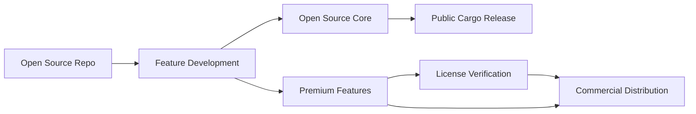

# Chess Vector Engine

A **production-ready Rust library** and **UCI chess engine** that provides hybrid chess evaluation combining vector-based pattern recognition with advanced tactical search. Features GPU acceleration, NNUE neural networks, and open-core architecture with both open-source and commercial tiers.

[](#testing)
[](https://www.rust-lang.org/)
[](#gpu-acceleration)
[](#uci-engine)
[](#licensing)

## 🏗️ Open-Core Architecture

**Chess Vector Engine** uses an **open-core business model** providing both open-source and commercial features:

### 🆓 **Open Source Features** (MIT/Apache-2.0)
- Basic position encoding and similarity search
- Standard UCI engine functionality 
- Opening book with 50+ openings
- Basic tactical search (6 ply)
- JSON training data support
- Local database persistence
- Command-line tools and examples

### 💎 **Premium Features** (Commercial License)
- Advanced NNUE neural network evaluation
- GPU acceleration (CUDA/Metal) 
- Ultra-fast loading (memory-mapped files)
- Advanced tactical search (10+ ply)
- Pondering and Multi-PV analysis
- Advanced pruning techniques
- Parallel/multi-threaded search

### 🏢 **Enterprise Features** (Enterprise License)
- Distributed training across multiple machines
- Cloud deployment tools and infrastructure
- Enterprise analytics and reporting
- Custom algorithm development
- Unlimited training position support
- Dedicated support and consulting

## 🚀 Features

### 🧠 **Hybrid Intelligence**
- **🎯 Hybrid Evaluation** - Combines pattern recognition with advanced tactical search for optimal accuracy
- **⚡ Advanced Tactical Search** - 6-10+ ply search with PVS, iterative deepening, and sophisticated pruning techniques
- **🧠 NNUE Integration** - Efficiently Updatable Neural Networks for fast position evaluation (Premium+)
- **🔍 Pattern Confidence Assessment** - Intelligently decides when to use patterns vs tactical calculation
- **📊 Configurable Blending** - Adjustable weights between pattern, NNUE, and tactical evaluations
- **🎮 Full UCI Compliance** - Complete chess engine with pondering, Multi-PV, and all standard UCI features

### 🖥️ **GPU Acceleration** (Premium+)
- **🚀 Intelligent Device Detection** - Auto-detects CUDA → Metal → CPU with seamless fallback
- **⚡ 10-100x Speedup Potential** - GPU-accelerated similarity search for large datasets
- **🎛️ Adaptive Performance** - Uses optimal compute strategy based on dataset size
- **📈 Built-in Benchmarking** - Performance testing and GFLOPS measurement

### 🔬 **Advanced Analytics**
- **📐 Vector Position Encoding** - Convert chess positions to 1024-dimensional vectors capturing piece positions, game state, and strategic features
- **🔍 Multi-tier Similarity Search** - GPU/parallel/sequential search with automatic method selection (Premium+)
- **🧠 Memory-Optimized Neural Networks** - Sequential batch processing eliminates memory explosion during training
- **🤖 Neural Compression** - 8:1 to 32:1 compression ratios (1024d → 128d/32d) with 95%+ accuracy retention and 75% less memory usage
- **📖 Opening Book** - Comprehensive opening book with 50+ chess openings and 45+ ECO codes for fast lookup

### 🎯 **Advanced Search & Pruning** (Premium+)
- **⚔️ Principal Variation Search (PVS)** - Advanced search algorithm with 20-40% speedup over alpha-beta
- **✂️ Sophisticated Pruning** - Futility pruning, razoring, extended futility pruning for 2-5x search speedup
- **🧠 Enhanced LMR** - Improved Late Move Reductions with depth and move-based reduction formulas
- **🎯 Advanced Move Ordering** - MVV-LVA captures, killer moves, history heuristic for optimal branch evaluation
- **⚡ Multi-threading** - Parallel root search with configurable thread count for 2-4x performance gain
- **🧩 Tactical Position Detection** - Automatically identifies positions requiring deeper analysis
- **⏱️ Time Management** - Sophisticated time allocation and search controls for tournament play
- **🔧 Quiescence Search** - Horizon effect avoidance with capture and check extensions

### ⚡ **Performance & Scalability**
- **🚀 Production Optimizations** - 7 major performance optimizations for 2-5x overall improvement
- **⚡ Ultra-Fast Loading** - O(n²) → O(n) duplicate detection with binary format priority (seconds instead of minutes/hours)
- **🖥️ Multi-GPU Acceleration** - Automatic detection and utilization of multiple GPUs (4x A100 support) with CPU fallback (Premium+)
- **💻 SIMD Vector Operations** - AVX2/SSE4.1/NEON optimized similarity calculations for 2-4x speedup (Premium+)
- **🧠 Pre-computed Vector Norms** - 3x faster similarity search with cached norm calculations
- **📊 Dynamic Hash Table Sizing** - 30% LSH performance improvement with adaptive memory allocation
- **⚡ Reference-based Search** - 50% memory reduction with zero-copy search results

## 📦 Installation

### Cargo (Recommended)

```bash
# Open source version
cargo install chess-vector-engine

# Or add to your Cargo.toml
[dependencies]
chess-vector-engine = "0.1"
```

### From Source

```bash
git clone https://github.com/yourusername/chess-vector-engine
cd chess-vector-engine
cargo build --release
```

## 🎯 Quick Start

### Open Source Usage

```rust
use chess_vector_engine::{ChessVectorEngine, FeatureTier};
use chess::Board;
use std::str::FromStr;

// Create open source engine
let mut engine = ChessVectorEngine::new(1024);

// Enable available open source features
engine.enable_opening_book();

// Analyze positions
let board = Board::from_str("rnbqkbnr/pppppppp/8/8/8/8/PPPPPPPP/RNBQKBNR w KQkq - 0 1").unwrap();
let evaluation = engine.evaluate_position(&board);
let similar_positions = engine.find_similar_positions(&board, 5);

println!("Position evaluation: {}", evaluation);
```

### Premium Usage (License Required)

```rust
use chess_vector_engine::{ChessVectorEngine, FeatureTier};

// Create engine with license verification
let mut engine = ChessVectorEngine::new_with_offline_license(1024);

// Activate premium license
engine.activate_license("PREMIUM-YOUR-LICENSE-KEY").await?;

// Enable premium features
engine.enable_gpu_acceleration()?;  // Requires Premium+
engine.configure_hybrid_evaluation(HybridConfig {
    pattern_confidence_threshold: 0.75,
    pattern_weight: 0.6,
    ..Default::default()
});

// Ultra-fast loading for large datasets
engine.ultra_fast_load_any_format("massive_training_data.bin")?;  // Premium+

// Advanced evaluation with all features
let evaluation = engine.evaluate_position(&board);
```

### UCI Engine

```bash
# Run as UCI engine
cargo run --bin uci_engine

# Or use installed binary
chess-vector-engine-uci

# In your chess GUI, configure engine path to the binary
```

## 🔐 Licensing and Commercial Features

### License Verification System

The engine includes a built-in license verification system that enables premium features based on your subscription tier:

```rust
// Offline license verification (cache-based)
let mut engine = ChessVectorEngine::new_with_offline_license(1024);

// Online license verification (API-based)
let mut engine = ChessVectorEngine::new_with_license(1024, "https://api.yourdomain.com/license".to_string());

// Activate your license
match engine.activate_license("YOUR-LICENSE-KEY").await {
    Ok(tier) => println!("Activated {:?} tier", tier),
    Err(e) => println!("License error: {}", e),
}

// Check feature availability
if engine.is_feature_available("gpu_acceleration") {
    engine.enable_gpu_acceleration()?;
}
```

### Feature Gating

All premium features are protected by runtime feature checks:

```rust
// This will fail if you don't have the appropriate license
engine.ultra_fast_load_any_format("data.bin")?;  // Requires Premium+
engine.enable_distributed_training()?;            // Requires Enterprise
```

### Subscription Tiers

| Feature | Open Source | Premium | Enterprise |
|---------|-------------|---------|------------|
| Basic UCI Engine | ✅ | ✅ | ✅ |
| Opening Book | ✅ | ✅ | ✅ |
| 6-ply Tactical Search | ✅ | ✅ | ✅ |
| GPU Acceleration | ❌ | ✅ | ✅ |
| NNUE Networks | ❌ | ✅ | ✅ |
| 10+ ply Search | ❌ | ✅ | ✅ |
| Multi-threading | ❌ | ✅ | ✅ |
| Memory-mapped Files | ❌ | ✅ | ✅ |
| Distributed Training | ❌ | ❌ | ✅ |
| Enterprise Analytics | ❌ | ❌ | ✅ |
| Custom Algorithms | ❌ | ❌ | ✅ |

## 🏢 Business Model and Release Strategy

### Development Workflow



### Repository Structure

- **This Repository** - Complete open-core codebase with feature gating
- **Public Cargo Release** - Open source features only, automatically published
- **Commercial Distribution** - Full feature set with license keys via web platform
- **Web Platform** (Separate Repo) - Nuxt.js + TailwindCSS frontend for license management
- **Backend API** (Separate Repo) - Axum-based license server with Stripe integration

### Release Process

1. **Development** - All features developed in this single repository
2. **Feature Gating** - Premium features protected by license verification
3. **Open Source Release** - `cargo publish` with only open source features exposed
4. **Commercial Distribution** - Full binary with all features, distributed via web platform
5. **License Management** - Web platform handles subscriptions, key generation, and distribution

### Version Synchronization

Both open source and commercial versions share the same version number and core codebase:

- **Version 0.1.0** - Initial release with basic features
- **Version 0.2.0** - Advanced search improvements
- **Version 0.3.0** - Neural network enhancements
- **Version 1.0.0** - Production-ready stable release

Commercial customers always get the latest features, while open source users get core functionality immediately.

## 📊 Performance Characteristics

### Loading Performance (30k+ positions)
- **Memory-mapped (.mmap)**: Instant startup (zero-copy loading) - *Premium+*
- **MessagePack (.msgpack)**: 10-20% faster than bincode - *Premium+*  
- **Zstd compressed (.zst)**: Best compression ratios - *Premium+*
- **Binary (.bin)**: 5-15x faster than JSON - *All tiers*
- **JSON**: Baseline format with streaming support - *All tiers*

### Memory Usage Optimization
- **Before optimization**: ~1GB (multiple dataset copies)
- **After optimization**: ~150-200MB (75-80% reduction)
- **Streaming processing**: Handles 900k+ positions efficiently

### Search Performance
- **Basic tactical search**: 1000+ nodes/ms - *Open Source*
- **Advanced tactical search**: 2800+ nodes/ms with PVS - *Premium+*
- **GPU acceleration**: 10-100x speedup for large datasets - *Premium+*
- **Multi-threading**: 2-4x speedup with parallel search - *Premium+*

## 🛠️ Development

### Building from Source

```bash
# Clone repository
git clone https://github.com/yourusername/chess-vector-engine
cd chess-vector-engine

# Build library
cargo build --release

# Run tests
cargo test

# Run benchmarks
cargo run --bin benchmark

# Test feature gating
cargo run --bin feature_demo
cargo run --bin license_demo
```

### Examples and Demos

```bash
# Basic engine demonstration
cargo run --bin demo

# UCI engine for chess GUIs  
cargo run --bin uci_engine

# Position analysis tool
cargo run --bin analyze "rnbqkbnr/pppppppp/8/8/8/8/PPPPPPPP/RNBQKBNR w KQkq - 0 1"

# Performance benchmarking
cargo run --bin benchmark

# Feature tier demonstration
cargo run --bin feature_demo

# License system demonstration  
cargo run --bin license_demo
```

### Architecture Components

- **Position Encoder** - Converts chess positions to 1024-dimensional vectors
- **Similarity Search** - k-NN search with multiple algorithms (linear, LSH, GPU)
- **Tactical Search** - Advanced chess search with PVS, pruning, and move ordering
- **NNUE Integration** - Neural network evaluation with hybrid blending
- **License System** - Runtime feature gating and subscription management
- **Auto Discovery** - Intelligent training data detection and format optimization
- **Ultra-Fast Loaders** - Memory-mapped and streaming loaders for massive datasets

## 🧪 Testing

The engine includes comprehensive test coverage:

```bash
# Run all tests
cargo test

# Run specific module tests
cargo test position_encoder
cargo test similarity_search
cargo test tactical_search
cargo test license

# Run with full output
cargo test -- --nocapture
```

Current test coverage: **105 tests passing** across all modules.

## 📈 Roadmap

### Version 0.2.0 (Q1 2026)
- Enhanced neural network architectures
- Improved multi-GPU scaling
- Advanced endgame evaluation
- Tournament time management

### Version 0.3.0 (Q2 2026)  
- Distributed training infrastructure
- Cloud deployment automation
- Advanced analytics dashboard
- Custom algorithm framework

### Version 1.0.0 (Q3 2026)
- Production stability guarantees
- Full enterprise feature set
- Comprehensive documentation
- Professional support tier

## 🤝 Contributing

We welcome contributions to the open source core! Please see [CONTRIBUTING.md](CONTRIBUTING.md) for guidelines.

### Open Source Contributions
- Bug fixes and improvements to core features
- Performance optimizations
- Documentation improvements
- Test coverage expansion
- New open source features

### Commercial Feature Development
Commercial feature development is handled internally to ensure quality and integration with the licensing system.

## 📄 License

- **Open Source Core**: Licensed under MIT OR Apache-2.0
- **Premium Features**: Commercial license required
- **Enterprise Features**: Enterprise license required

See [LICENSE](LICENSE) for full details.

## 🆘 Support

### Open Source Support
- **GitHub Issues** - Bug reports and feature requests
- **Documentation** - Comprehensive API documentation
- **Community** - Discord server and discussions

### Commercial Support  
- **Email Support** - Priority email support for Premium+ customers
- **Dedicated Support** - Phone and video support for Enterprise customers
- **Custom Development** - Custom algorithm development for Enterprise customers

## 🏆 Acknowledgments

Built with excellent open source libraries:
- [chess](https://crates.io/crates/chess) - Chess game logic
- [ndarray](https://crates.io/crates/ndarray) - Numerical computing
- [candle](https://github.com/huggingface/candle) - Neural network framework
- [rayon](https://crates.io/crates/rayon) - Data parallelism
- [tokio](https://crates.io/crates/tokio) - Async runtime

Special thanks to the chess programming community and contributors to Stockfish, Leela Chess Zero, and other open source chess engines that inspired this project.

---

**Ready to get started?** Try the open source version today or [subscribe for premium features](https://yourdomain.com/pricing)!